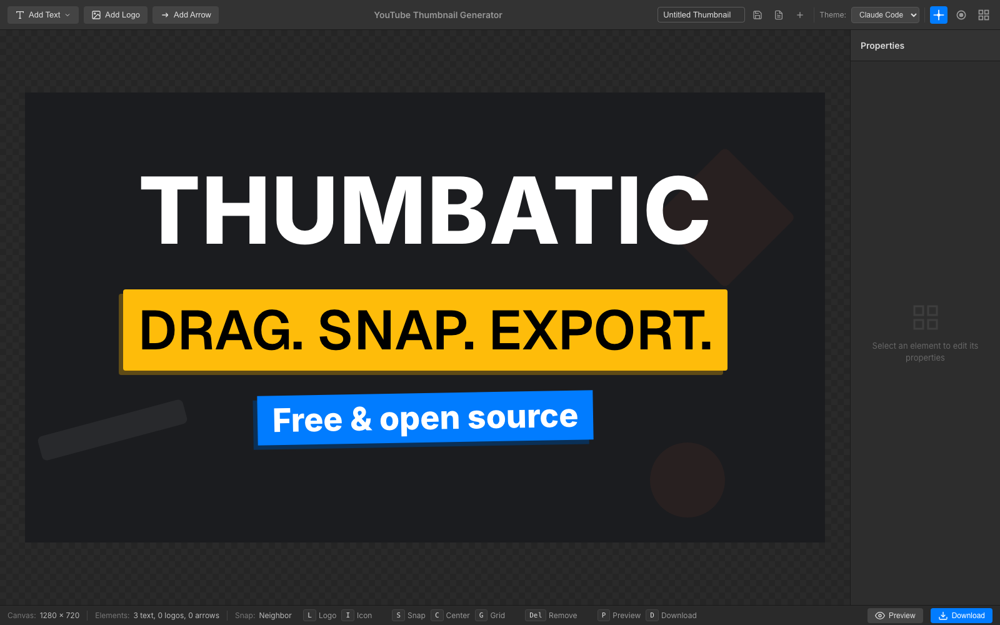
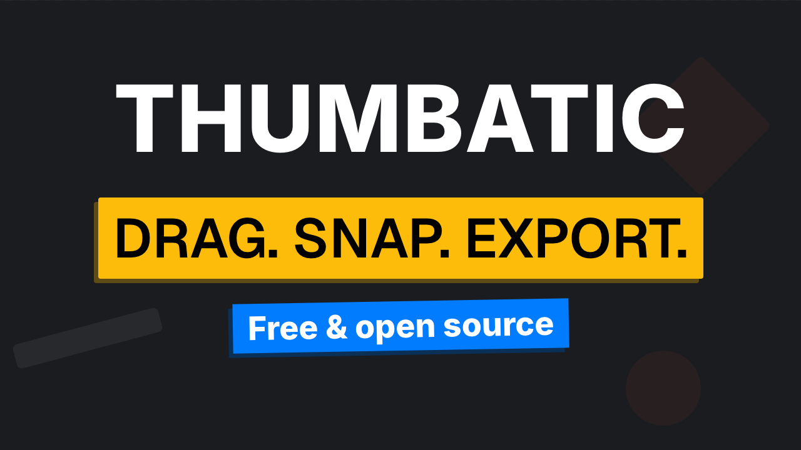
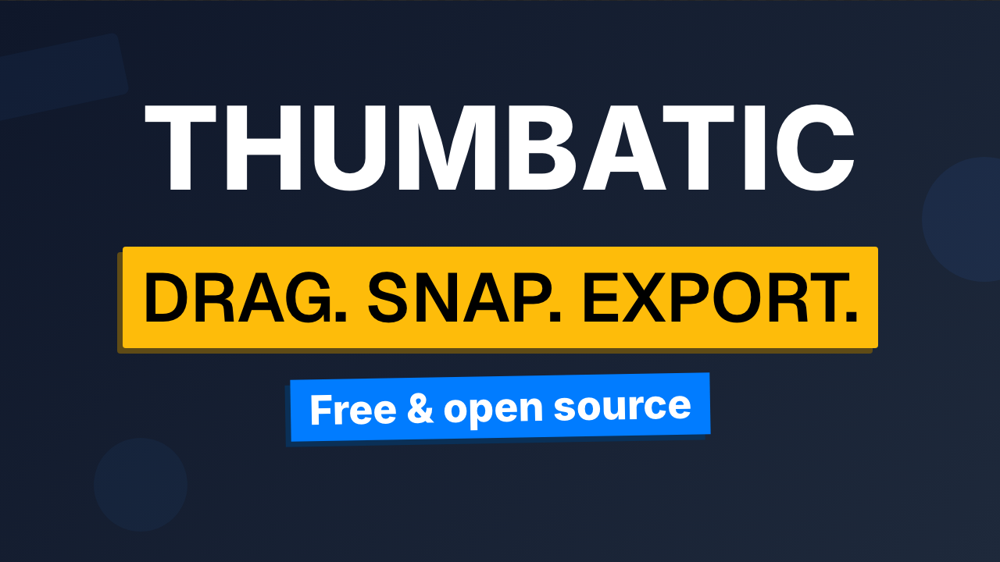
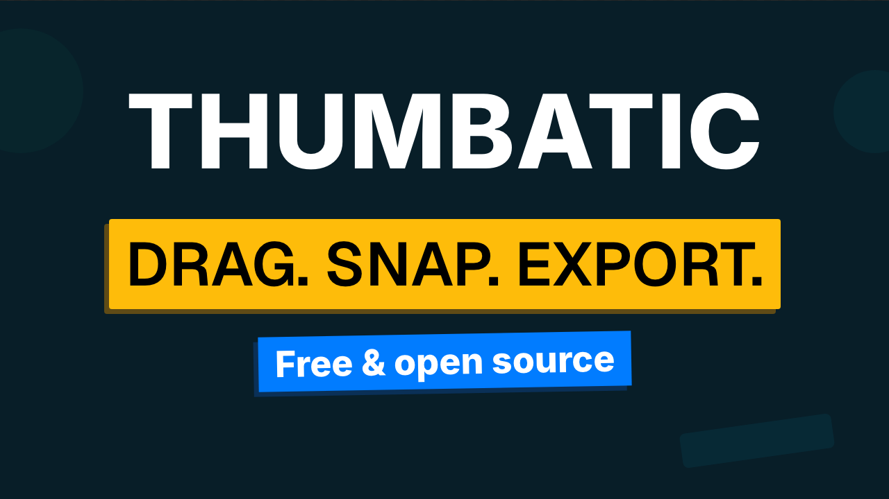
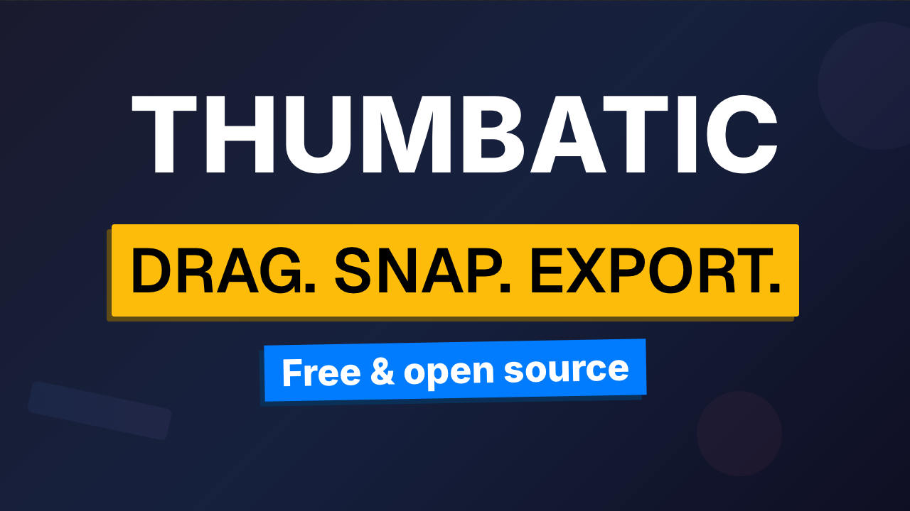
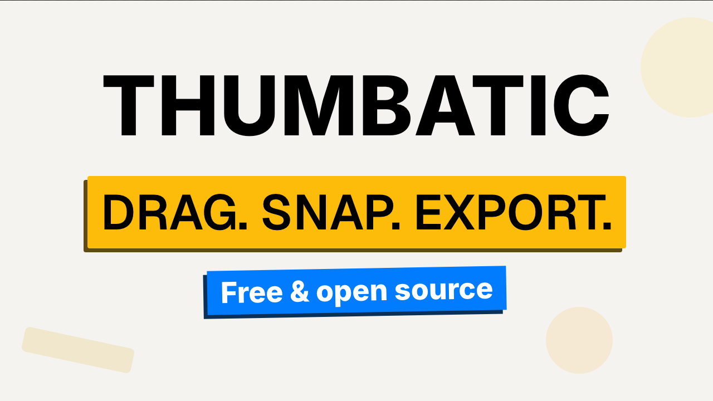

# Thumbatic

[](LICENSE)

A browser-based editor for professional YouTube thumbnails. Place text, logos, and arrows on a
1280×720 canvas, pick a theme, and export a PNG at YouTube's exact thumbnail size.

**[Try the demo at demo.thumbatic.com](https://demo.thumbatic.com)**. It needs no account and
sends nothing to a server. Your thumbnails are saved in your own browser, and clearing site data
removes them.

Thumbatic runs fully client-side by default: no account, no server, no build-time configuration.
An optional Cloudflare Workers + Durable Objects backend is included if you want thumbnails stored
server-side instead of in the browser.

## Screenshots

The editor: toolbar, canvas, properties panel, and status bar.



The same content in each of the five themes:

| Claude Code | Cloudflare |
|-------------|------------|
|  |  |

| Codex | Gemini |
|-------|--------|
|  |  |

| Pencil |
|--------|
|  |

## Features

- **1280×720 canvas** that matches the YouTube thumbnail specification exactly.
- **Text elements** in four presets (title, subtitle, accent label, custom) with inline editing,
  multi-line support, highlight/drop-shadow backgrounds, rotation, opacity, and alignment.
- **Logo elements** from a built-in library of 79 tech logos (Cloud, Frontend, Backend, AI,
  Database, DevOps, Design, Testing, Languages, Tools) or from any custom image URL.
- **Arrow elements** drawn directly on the canvas, with bezier control point, stroke width, color,
  and arrowheads on either end.
- **Five themes**: Claude Code, Cloudflare, Codex, Gemini, and Pencil.
- **Three snapping modes**: neighbor snapping to other text elements, canvas-center snapping, and
  grid snapping. Alignment guides appear while you drag.
- **Preview mode** that shows the thumbnail at real YouTube display sizes.
- **PNG export** captured at 2× and downscaled to 1280×720 for crisp text.
- **Saved thumbnails** with a 2-second debounced auto-save, through a pluggable storage backend.

## Prerequisites

- **Node.js** v22.14.0 (see `.nvmrc`)
- **npm** v9 or higher

With [nvm](https://github.com/nvm-sh/nvm):

```bash
nvm install
nvm use
```

## Quick Start

```bash
git clone https://github.com/buildatscale-tv/thumbatic.git
cd thumbatic
npm install
npm run dev
```

Open the URL printed in the terminal (usually `http://localhost:5173`).

No environment file is needed. The default storage backend is the browser's `localStorage`, so
everything works offline and on the first run.

## Commands

| Command | Description |
|---------|-------------|
| `npm run dev` | Start the Vite development server with hot module replacement |
| `npm run build` | Type-check with `tsc -b` and build the production bundle into `dist/` |
| `npm run lint` | Run ESLint with the TypeScript and React rules |
| `npm test` | Run the Vitest suite once |
| `npm run test:watch` | Run the tests and rerun them on every change |
| `npm run preview` | Serve the production build locally |
| `npm run deploy` | Deploy the current `dist/` build to Cloudflare Workers with Wrangler |
| `npm run deploy:prod` | Build, then deploy to Cloudflare Workers |
| `npm run deploy:demo` | Build with the local storage backend, then deploy the public demo |

## Using the Editor

The layout is a top toolbar, the canvas, a properties panel on the right, and a status bar.

- **Toolbar**: add text, add a logo, draw an arrow, choose a theme, toggle snapping modes, and
  manage saved thumbnails (name field, save, open, new).
- **Canvas**: click an element to select it, double-click text to edit it, and drag to move.
- **Properties panel**: edit the properties of the selected element.
- **Status bar**: element counts, the active snap mode, preview, and export.

### Keyboard Shortcuts

| Key | Action |
|-----|--------|
| `L` | Open the logo library |
| `A` | Toggle arrow drawing mode |
| `S` | Toggle snapping |
| `C` | Toggle center-snap mode |
| `G` | Toggle the grid |
| `P` | Toggle preview mode |
| `D` | Download the PNG |
| `Ctrl`/`Cmd` + `S` | Save the current thumbnail |
| `Delete` / `Backspace` | Remove the selected element |
| `Esc` | Stop editing and deselect |
| Arrow keys | Move the selected element by 1 px |
| `Shift` + arrow keys | Move by 10 px |
| `Cmd`/`Ctrl` + `Shift` + arrow keys | Move by 50 px |
| `Alt` + `↑`/`↓` | Change the z-index by 100 (add `Shift` for 500) |
| `Tab` / `Shift` + `Tab` | Move to the next/previous text element while editing |

### Export

The export button (or `D`) renders the canvas with
[modern-screenshot](https://github.com/qq15725/modern-screenshot) at 2× scale, draws it onto a
1280×720 canvas, and downloads a PNG. The file name comes from the title text, for example
`MY-TITLE-intro-thumbnail.png`.

## Storage

Persistence goes through a small adapter interface (`list`, `get`, `create`, `save`, `delete`), so
the backend is a one-line configuration change.

| Backend | `VITE_STORAGE_BACKEND` | Where the data is | When to use it |
|---------|------------------------|-------------------|----------------|
| Local storage (default) | `local` (or unset) | Browser `localStorage`, key `thumbatic-thumbnails` | Static hosting, single browser, no server |
| Durable Objects | `durable-objects` | Cloudflare Durable Object with SQLite, through `/api/thumbnails` | Thumbnails shared between browsers and devices |

Any other value falls back to `local`.

`local` is the default everywhere. The repository contains no env file, and an unset or invalid
`VITE_STORAGE_BACKEND` falls back to `local`, so a fresh clone runs fully client-side in both
development and production.

Select a different backend at **build time**, because Vite inlines `import.meta.env` values into
the bundle:

```bash
VITE_STORAGE_BACKEND=durable-objects npm run build
```

To make the choice permanent for your own deployments only, put it in a git-ignored env file. Vite
reads `.env.[mode].local` last, so it wins over every other file:

```bash
# .env.production.local — your builds and deploys only, never committed
VITE_STORAGE_BACKEND=durable-objects
```

Use `.env.development.local` for the same control over `npm run dev`. Keep the `durable-objects`
value out of `.env.production`, because that file is committed and would change the default for
everybody.

### Save Behavior

- On start-up the app loads the most recently created thumbnail, if one exists.
- After a thumbnail exists, all changes auto-save with a 2-second debounce.
- The save button and `Ctrl`/`Cmd` + `S` save immediately.
- "New" creates a record named `Untitled Thumbnail` and resets the editor to the defaults.

### Adding a Backend

1. Implement `StorageAdapter` from `src/storage/types.ts` in a new file in `src/storage/`.
2. Add the identifier to the `StorageBackend` union in `src/storage/types.ts` and to
   `VALID_BACKENDS` in `src/storage/config.ts`.
3. Register the class in the factory in `src/storage/index.ts`.

Components never construct an adapter directly. They call `getStorageAdapter()`.

## Adding a Theme

A theme is a CSS class plus three small registrations. `ThumbnailCanvas.tsx` puts the class
`` `${theme}-theme` `` on the canvas, so a theme with the id `sunset` uses the selector
`.sunset-theme`.

1. **Register the id** in `src/types.ts`:
   - Add it to the `Theme` union.
   - Add it to `THEME_TYPES` as `'light'` or `'dark'`. This controls the title color that
     `setTheme` applies (black for light themes, white for dark themes).
2. **Add the menu entry** in the theme `<select>` in `src/components/Toolbar.tsx`:
   `<option value="sunset">Sunset</option>`.
3. **Add the styles** in `src/styles/thumbnail.css`. Copy an existing block, for example
   `.gemini-theme`, and change the colors. These selectors are available:

   | Selector | Purpose |
   |----------|---------|
   | `.sunset-theme` | Canvas background |
   | `.sunset-theme .title-wrapper` / `.title-text` / `.title-highlight` | Title styling |
   | `.sunset-theme .subtitle-text, .subtitle, .selectable-element.subtitle` | Subtitle styling |
   | `.sunset-theme .logo-section` | Position of the logo area |
   | `.sunset-theme .accent-shapes`, `.shape`, `.shape-1`, `.shape-2`, `.shape-3` | Background shapes |
   | `.sunset-theme .decorative-icon.icon-1`, `.icon-3` | Decorative icon colors |

Nothing else is necessary. Saved thumbnails store the theme id, so do not rename an id after
thumbnails use it.

### Sample Agent Prompt

Give a coding agent this prompt, and change the name and the colors:

```text
Add a new theme called "Sunset" (id: sunset) to this Thumbatic repository.

It is a dark theme: a warm gradient background from #2b1055 to #7597de, an orange
accent (#ff8c42), and white title text.

Make these changes, and follow the pattern of the existing "gemini" theme exactly:

1. src/types.ts — add 'sunset' to the Theme union, and add `sunset: 'dark'` to THEME_TYPES.
2. src/components/Toolbar.tsx — add <option value="sunset">Sunset</option> to the theme
   <select>, after the existing options.
3. src/styles/thumbnail.css — add a .sunset-theme block that copies the structure of the
   .gemini-theme block: the canvas background, .title-wrapper, .title-text, .title-highlight,
   the subtitle selectors, .accent-shapes with .shape-1 to .shape-3, and the .decorative-icon
   colors. Keep the shapes subtle (opacity 0.06 to 0.10).

Rules:
- Do not change any other theme.
- Keep the id 'sunset' the same in all three files, because the canvas class is
  `${theme}-theme`.
- Make sure `npm run build` and `npm run lint` pass.
- Then start the development server, select the Sunset theme, and confirm that the title,
  subtitle, and accent label stay legible against the background.
```

## Configuration

| Variable | Where | Required | Description |
|----------|-------|----------|-------------|
| `VITE_STORAGE_BACKEND` | Build environment (`.env`) | No | `local` (default) or `durable-objects` |
| `GATE_SECRET` | Cloudflare Worker secret (`.dev.vars` locally) | No | Enables the access gate. If it is not set, the gate is off. |

Both `.env` and `.dev.vars` are git-ignored.

## Deployment

### Option 1 — Any Static Host (default)

With the `local` backend the application is fully static.

```bash
npm run build
```

Upload the contents of `dist/`. This works on Vercel, Netlify, Cloudflare Pages, GitHub Pages,
Amazon S3 + CloudFront, or any web server. Each visitor's thumbnails stay in their own browser.

### Option 2 — Cloudflare Workers + Durable Objects

This gives you server-side storage. `wrangler.toml` already declares the Worker, the `ThumbnailDO`
Durable Object with SQLite, and the static-asset binding.

1. **Edit `wrangler.toml`.** Change `name` to your own Worker name and delete or replace the two
   `[[routes]]` blocks, which point at `thumbatic.com`. Keep them only if that zone is in your
   Cloudflare account.

2. **Authenticate Wrangler.**

   ```bash
   npx wrangler login
   ```

3. **Select the backend** by putting `VITE_STORAGE_BACKEND=durable-objects` in `.env`.

4. **Build and deploy.**

   ```bash
   npm run deploy:prod
   ```

The Worker sends `/api/*` requests to the Durable Object and serves everything else from the built
assets, with single-page-application fallback.

**Important:** the Worker uses one Durable Object instance (`idFromName('global')`), and the API has
no per-user authentication. Everyone who can reach the deployment reads and writes the same set of
thumbnails. Use the access gate below, add your own authentication, or keep the `local` backend for
a public deployment.

### The Public Demo Environment

`wrangler.toml` also defines a `demo` environment, which is what runs at
[demo.thumbatic.com](https://demo.thumbatic.com). Deploy it with:

```bash
npm run deploy:demo
```

Three things make that deployment safe to leave open:

- The build sets `VITE_STORAGE_BACKEND=local`, so thumbnails never leave the visitor's browser.
- The environment declares **no** Durable Object binding, so there is no server side store at all.
  The Worker answers 404 for `/api/*` when the binding is missing, which means nobody can read or
  write a shared store through the demo.
- No `GATE_SECRET` is set for it, so the access gate stays off.

Wrangler prints a warning that `durable_objects` is not inherited by the `demo` environment. That
is intentional, not a misconfiguration.

### Optional Access Gate

If the `GATE_SECRET` secret is set, the Worker blocks all requests that do not have it:

```bash
npx wrangler secret put GATE_SECRET
```

- Visit `https://your-worker.example/?key=<secret>` once. The Worker sets an `auth` cookie that is
  valid for one year and removes the key from the URL.
- Visit `?lock` to clear the cookie.
- All other visitors are redirected to the address in `GATE_REDIRECT` in `src/worker/index.ts`,
  which is `https://buildatscale.tv` by default. Change that constant for your own deployment.
- For local Worker runs, put `GATE_SECRET=...` in `.dev.vars`.

### Local Development Against the Worker

`npm run dev` starts only the Vite server, which does not proxy `/api`. To test the
`durable-objects` backend locally, run the Worker instead:

```bash
npm run build
npx wrangler dev
```

Wrangler serves the built assets from `dist/` and runs the Durable Object with local storage. If you
want hot module replacement together with the API, add a `server.proxy` entry for `/api` in
`vite.config.ts` that points at the `wrangler dev` port.

## Project Structure

```
src/
├── App.tsx                     # Root component: drag, snapping, shortcuts, auto-save
├── main.tsx                    # React entry point
├── types.ts                    # Core type definitions (elements, themes, store state)
├── store/thumbnailStore.ts     # Zustand store
├── api/thumbnails.ts           # Client for the Worker API
├── storage/
│   ├── types.ts                # StorageAdapter interface and record types
│   ├── config.ts               # Backend selection (VITE_STORAGE_BACKEND)
│   ├── local.ts                # LocalStorageAdapter (default)
│   ├── durable-object.ts       # DurableObjectAdapter (optional)
│   ├── serialize.ts            # Store state <-> stored record
│   └── index.ts                # getStorageAdapter() factory
├── do/ThumbnailDO.ts           # Durable Object with SQLite storage
├── worker/index.ts             # Worker entry: access gate, API routing, assets
├── components/
│   ├── ThumbnailGenerator.tsx  # Layout container
│   ├── ThumbnailCanvas.tsx     # 1280×720 preview
│   ├── Toolbar.tsx             # Tools, theme, snap toggles, thumbnail management
│   ├── PropertiesPanel.tsx     # Properties of the selected element
│   ├── StatusBar.tsx           # Counts, hints, preview, export
│   ├── DraggableElement.tsx    # Drag wrapper
│   ├── GridOverlay.tsx         # Grid guides
│   ├── LogoLibraryModal.tsx    # Logo picker
│   ├── PreviewMode.tsx         # YouTube-size preview
│   ├── controls/               # Export button
│   ├── thumbnail/              # Text, logo, arrow, guide, and accent renderers
│   └── ui/                     # Reusable UI components
├── hooks/useSnapping.ts        # Snapping system
├── utils/                      # Snap and grid-snap calculations
├── constants/logos.ts          # Logo library
└── styles/                     # CSS (themes, layout, UI)
```

## Tech Stack

- **React 19** with TypeScript 5.8 in strict mode
- **Vite 7** for development and builds
- **Zustand 5** for state, with no providers
- **modern-screenshot 4** for client-side PNG export
- **Wrangler 4** for the optional Cloudflare Workers deployment

## Browser Support

Modern browsers with ES2020 support: Chrome/Edge 90+, Firefox 88+, Safari 15+. Chrome and Edge give
the most reliable export results.

## Troubleshooting

**The development server does not start**
- Use Node.js v22.14.0 (`nvm use`).
- Delete `node_modules` and run `npm install` again.
- Make sure port 5173 is free.

**Saved thumbnails do not appear**
- With the `local` backend, data is per browser and per profile. Private windows and cleared site
  data remove it.
- With the `durable-objects` backend, check the browser console for failed `/api/thumbnails`
  requests.
- If a save shows "Unknown error" and the console shows a 404 for `/api/thumbnails` with
  `Unexpected token '<'`, the page runs the `durable-objects` backend against the Vite dev server,
  which does not serve `/api`. Use `local` in development, or run the Worker with
  `npm run build && npx wrangler dev`.

**Export fails or images are missing**
- Wait until all logos have loaded, then export again.
- Custom logo URLs must allow cross-origin reads.
- Check the browser console. The export falls back to a simpler capture method if the first attempt
  fails.

**Deployment redirects to another site**
- The `GATE_SECRET` access gate is active. Open the site once with `?key=<secret>`, or remove the
  secret with `npx wrangler secret delete GATE_SECRET`.

## Contributing

Before you commit:

1. `npm run lint` must pass. It currently reports zero problems.
2. `npm test` must pass.
3. `npm run build` must complete, including the TypeScript check.
4. Test the change in the development server.

## License

MIT. See [LICENSE](LICENSE).
